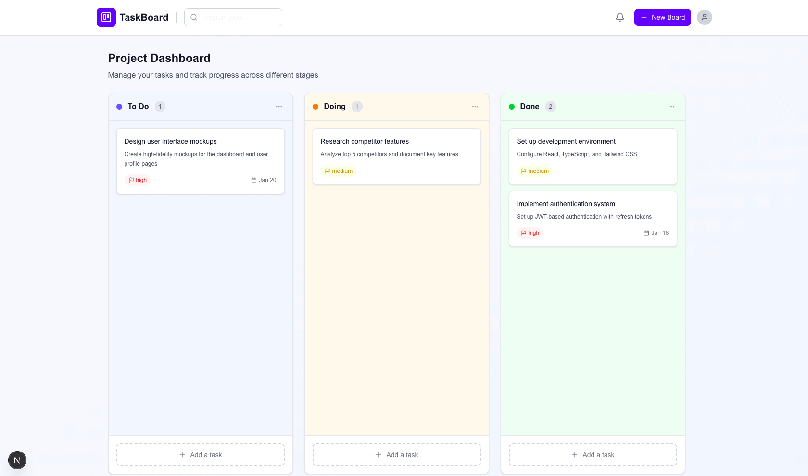

# Make Trello Great Again 🚀

A modern, fast, and beautiful Kanban board application built with the latest web technologies. This is my personal take on making project management simple, responsive, and actually enjoyable to use.

## ✨ Why This Exists

Trello was great, but it got bloated. This is a fresh, lightweight alternative that focuses on speed, simplicity, and a great developer experience. Built for people who want to manage their tasks without the overhead.

## 🛠️ Tech Stack

Built with cutting-edge technologies for maximum performance and developer experience:

- **[Next.js 16](https://nextjs.org/)** - The latest React framework with App Router, Server Components, and optimized rendering
- **[React 19](https://react.dev/)** - Latest React with improved performance and concurrent features
- **[Convex](https://www.convex.dev/)** - Real-time backend with automatic reactivity, no API routes needed
- **[Better Auth](https://www.better-auth.com/)** - Modern authentication with built-in security best practices
- **[Bun](https://bun.sh/)** - Lightning-fast JavaScript runtime and package manager
- **[TypeScript](https://www.typescriptlang.org/)** - Full type safety across the entire stack
- **[Tailwind CSS 4](https://tailwindcss.com/)** - Latest utility-first CSS framework
- **[dnd-kit](https://dndkit.com/)** - Modern drag and drop with excellent accessibility
- **[TanStack Virtual](https://tanstack.com/virtual)** - Virtualization for smooth performance with large lists
- **[Radix UI](https://www.radix-ui.com/)** - Unstyled, accessible component primitives
- **[Sonner](https://sonner.emilkowal.ski/)** - Beautiful toast notifications

## 🚀 Features

### Core Functionality

- **Kanban Boards** - Organize tasks in customizable boards with color-coded themes
- **Drag & Drop** - Smooth, intuitive task movement between columns (To Do, Doing, Done)
- **Real-time Updates** - Changes sync instantly across all connected clients via Convex
- **Task Management** - Rich task details with priorities, due dates, and descriptions
- **Search** - Fast, instant search across all tasks in a board
- **Optimistic Updates** - UI updates immediately for snappy, responsive feel

### Collaboration

- **Board Members** - Invite team members to collaborate on boards
- **Invitations System** - Email-based invitations with pending invitation management
- **Role-based Access** - Owner and member roles with appropriate permissions
- **Member Management** - Add, remove, and manage board collaborators

### User Experience

- **Modern UI** - Clean, gradient-based design with smooth animations
- **Responsive Design** - Works beautifully on desktop, tablet, and mobile
- **Fast Performance** - Optimized with virtualization, code splitting, and efficient rendering
- **Type-safe** - End-to-end TypeScript for fewer bugs and better DX
- **Accessible** - Built with Radix UI for WCAG compliance

## 🏃‍♂️ Getting Started

### Prerequisites

- [Bun](https://bun.sh/) (latest version)
- [Convex account](https://www.convex.dev/) (free tier works great)

### Installation

1. **Clone the repository**

   ```bash
   git clone <your-repo-url>
   cd kanban-board
   ```

2. **Install dependencies**

   ```bash
   bun install
   ```

3. **Set up Convex**

   ```bash
   bunx convex dev
   ```

   This will:
   - Create a new Convex project (or connect to existing)
   - Generate environment variables
   - Push your schema and functions
   - Start the Convex dev server

4. **Configure environment variables**

   Create a `.env.local` file with:

   ```env
   NEXT_PUBLIC_CONVEX_URL=your-convex-url
   CONVEX_SITE_URL=http://localhost:3000
   ```

5. **Run the development server**

   ```bash
   bun run dev
   # or with Bun's native runtime
   bun run dev:bun
   ```

6. **Open your browser**

   Navigate to [http://localhost:3000](http://localhost:3000)

## 📜 Available Scripts

- `bun run dev` - Start Next.js dev server
- `bun run dev:bun` - Start with Bun's native runtime (faster)
- `bun run build` - Build for production
- `bun run start` - Start production server
- `bun run lint` - Run ESLint
- `bun run format` - Format code with Prettier
- `bun run format:check` - Check code formatting

## 🏗️ Project Structure

```
kanban-board/
├── app/                    # Next.js App Router
│   ├── api/               # API routes
│   ├── boards/            # Board pages
│   └── tasks/              # Task pages
├── components/            # React components
│   └── ui/                # Reusable UI components
├── convex/                # Convex backend functions
│   ├── boards.ts          # Board management
│   ├── tasks.ts           # Task management
│   ├── auth.ts            # Authentication
│   └── notes.ts           # Notes feature
├── lib/                   # Utility libraries
└── types/                 # TypeScript type definitions
```

## 🎯 What Makes It Fast

- **Bun Runtime** - 3-4x faster than Node.js for package management and execution
- **Convex Real-time** - Sub-second updates without polling or websocket management
- **React 19** - Latest concurrent features for smoother UI
- **Virtualization** - Only render visible tasks for large boards
- **Optimistic Updates** - Instant UI feedback before server confirmation
- **Next.js 16** - Optimized bundling, code splitting, and server components
- **Tailwind CSS 4** - Zero-runtime CSS with minimal bundle size

## 🔐 Authentication

Uses Better Auth with Convex integration for secure, session-based authentication. No complex JWT management needed.

## 📝 Notes

This is a personal project built for my own use. Feel free to fork, modify, and make it your own. The codebase is clean, well-typed, and should be easy to understand and extend.

## 📄 License

MIT - Do whatever you want with it.

---

**Built with ❤️ and the latest web technologies**
